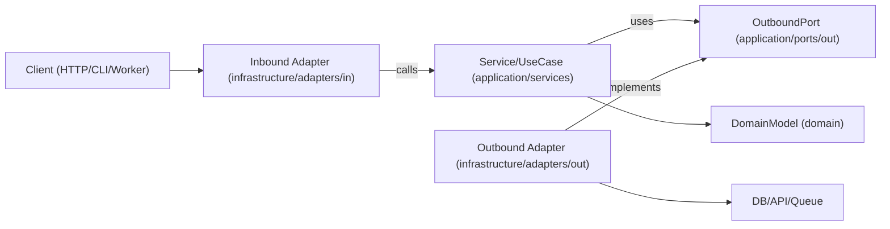

# Hexagonal Architecture

Hexagonal architecture (Ports and Adapters) keeps business logic independent from frameworks, transport, and persistence details. The core app depends on abstract ports, and adapters implement those ports at the edges.

## When to Use

- Building new features where long-term maintainability and testability matter.
- Refactoring layered or framework-heavy code where domain logic is mixed with I/O concerns.
- Supporting multiple interfaces for the same use case (HTTP, CLI, queue workers, cron jobs).
- Replacing infrastructure (database, external APIs, message bus) without rewriting business rules.

Use this skill when the request involves boundaries, domain-centric design, refactoring tightly coupled services, or decoupling application logic from specific libraries.

## Core Concepts

- **Domain (`domain`)**: Business rules, entities, and value objects. No framework imports or external dependencies.
- **Application (`application/services`)**: Orchestrate domain behavior, use cases, and workflow steps.
- **Inbound Ports (`application/ports/in`)**: Contracts describing what the application can do (commands/queries/use-case interfaces).
- **Outbound Ports (`application/ports/out`)**: Contracts for dependencies the application needs (repositories, gateways, event publishers, clock, UUID, etc.).
- **Adapters (`infrastructure/adapters`)**: Infrastructure and delivery implementations of ports.
  - **In (`in`)**: Controllers, resolvers, message consumers triggering inbound ports.
  - **Out (`out`)**: Repositories, external API SDKs implementing outbound ports.
- **Composition Root (NestJS Modules)**: Single wiring location (`*.module.ts`) where concrete infrastructure adapters are bound to application ports via Dependency Injection.

Dependency direction is always inward:

- Infrastructure (Adapters) -> Application / Domain
- Application -> Port interfaces (inbound/outbound contracts)
- Domain -> Domain-only abstractions (no framework or infrastructure dependencies)
- Domain -> Nothing external

## How It Works

### Step 1: Model a use case boundary

Define a single use case with a clear input and output DTO inside the `application` layer. Keep transport details (Express `req`, GraphQL `context`, job payload wrappers) outside this boundary, firmly in the `infrastructure/adapters/in`.

### Step 2: Define outbound ports first

Identify every side effect as a port inside `application/ports/out`:

- persistence (`UserRepositoryPort`)
- external calls (`BillingGatewayPort`)
- cross-cutting (`LoggerPort`)

Ports should model capabilities, not technologies.

### Step 3: Implement the application service (use case)

The service (`application/services`) receives ports via constructor injection. It validates application-level invariants, coordinates domain rules, and returns plain data structures.

### Step 4: Build adapters at the edge

- **Inbound adapter (`infrastructure/adapters/in`)** converts protocol input to use-case input.
- **Outbound adapter (`infrastructure/adapters/out`)** maps app contracts to concrete APIs/ORM/query builders.
- Mapping stays in adapters, not inside use cases.

### Step 5: Wire everything in the composition root (Module)

Use NestJS `@Module()` decorators to provide adapters and inject them into services using custom tokens. Keep this wiring centralized to avoid hidden service-locator behavior and keep the application framework-agnostic where possible.

### Step 6: Test per boundary

- Unit test application services with fake ports.
- Integration test outbound adapters with real infra dependencies.
- E2E test user-facing flows through inbound adapters.

## Architecture Diagram



## **Suggested Module Layout**

Use feature-first organization with explicit layer boundaries aligned with NestJS standards:

```text  
src/  
  common/  
    application/  
      ports/  
        in/  
        out/  
      services/  
    domain/  
      entities/  
        base.entity.ts  
    infrastructure/  
      adapters/  
        in/  
        out/  
    common.module.ts  
  users/  
    application/  
      ports/  
        in/  
          create-user.use-case.ts  
        out/  
          user-repository.port.ts  
      services/  
        create-user.service.ts  
    domain/  
      entities/  
        user.entity.ts  
    infrastructure/  
      adapters/  
        in/  
          user.controller.ts  
        out/  
          postgres-user.repository.ts  
    users.module.ts  
  app.module.ts  
  main.ts
```

## **TypeScript (NestJS) Example**

### **Port definitions (Application Layer)**

```TypeScript  
// src/users/application/ports/out/user-repository.port.ts
import { User } from '../../../domain/entities/user.entity';

// Unique symbol or string for NestJS DI token
export const USER_REPOSITORY_PORT = Symbol('USER_REPOSITORY_PORT');

export interface UserRepositoryPort {
  save(user: User): Promise<void>;
  findById(userId: string): Promise<User | null>;
}
```

### **Application Service (Use Case)**

```TypeScript  
// src/users/application/services/create-user.service.ts
import { Injectable, Inject } from '@nestjs/common';
import { User } from '../../domain/entities/user.entity';
import { UserRepositoryPort, USER_REPOSITORY_PORT } from '../ports/out/user-repository.port';

export type CreateUserInput = {
  id: string;
  email: string;
};

@Injectable()
export class CreateUserService {
  constructor(
    @Inject(USER_REPOSITORY_PORT) 
    private readonly userRepository: UserRepositoryPort
  ) {}

  async execute(input: CreateUserInput): Promise<User> {
    const user = User.create({ id: input.id, email: input.email });
    
    // Domain logic/validation happens inside User entity
    await this.userRepository.save(user);

    return user;
  }
}
```

### **Outbound Adapter (Infrastructure Layer)**

```TypeScript  
// src/users/infrastructure/adapters/out/postgres-user.repository.ts
import { Injectable } from '@nestjs/common';
import { User } from '../../../domain/entities/user.entity';
import { UserRepositoryPort } from '../../../application/ports/out/user-repository.port';
import { DataSource } from 'typeorm'; // Example ORM

@Injectable()
export class PostgresUserRepository implements UserRepositoryPort {
  constructor(private readonly dataSource: DataSource) {}

  async save(user: User): Promise<void> {
    await this.dataSource.query(
      "INSERT INTO users (id, email) VALUES ($1, $2)",
      [user.id, user.email]
    );
  }

  async findById(userId: string): Promise<User | null> {
    const [row] = await this.dataSource.query("SELECT * FROM users WHERE id = $1", [userId]);
    return row ? User.rehydrate(row) : null;
  }
}
```

### **Composition Root (NestJS Module)**

```TypeScript  
// src/users/users.module.ts
import { Module } from '@nestjs/common';
import { CreateUserService } from './application/services/create-user.service';
import { PostgresUserRepository } from './infrastructure/adapters/out/postgres-user.repository';
import { USER_REPOSITORY_PORT } from './application/ports/out/user-repository.port';
import { UserController } from './infrastructure/adapters/in/user.controller';

@Module({
  controllers: [UserController],
  providers: [
    CreateUserService,
    {
      provide: USER_REPOSITORY_PORT,
      useClass: PostgresUserRepository, // Dependency Inversion
    },
  ],
  exports: [CreateUserService]
})
export class UsersModule {}
```

## **Multi-Language Mapping**

Use the same boundary rules across ecosystems; only syntax and wiring style change.

* **TypeScript/JavaScript (NestJS)**
  * Separation: application, domain, infrastructure per module.
  * Ports: Interfaces and DI Tokens (Symbol or strings) in application/ports/*.
  * Use cases: @Injectable() classes in application/services.
  * Adapters: @Controller() or @Injectable() in infrastructure/adapters/*.
  * Composition: NestJS @Module() definitions.
* **Java**
  * Packages: domain, application.port.in, application.port.out, application.service, infrastructure.adapter.in, infrastructure.adapter.out.
  * Ports: Interfaces in application.port.*.
  * Use cases: Plain classes (Spring @Service is optional, not required).
  * Composition: Spring @Configuration or manual wiring class.
* **Kotlin**
  * Modules/packages mirror the Java split (domain, application/ports, application/services, infrastructure/adapters).
  * Ports: Kotlin interfaces.
  * Use cases: Classes with constructor injection (Koin/Dagger/Spring/manual).
  * Composition: Module definitions or dedicated composition functions.
* **Go**
  * Packages: internal/\<feature\>/domain, application/services, application/ports, infrastructure/adapters/in, infrastructure/adapters/out.
  * Ports: Small interfaces owned by the consuming application package.
  * Use cases: Structs with interface fields plus explicit New... constructors.
  * Composition: Wire in cmd/\<app\>/main.go (or dedicated wiring package).

## **Anti-Patterns to Avoid**

* Domain entities importing ORM models (e.g., TypeORM @Entity mixed with Domain logic), web framework types, or SDK clients.
* Use cases (Application Services) reading directly from req, res, or queue metadata.
* Returning database rows directly from use cases without domain/application mapping.
* Letting adapters call each other directly instead of flowing through use-case ports.
* Skipping DI tokens and injecting concrete repository classes directly into application services.

## **Migration Playbook**

1. Pick one vertical slice (single endpoint/job) with frequent change pain.
2. Extract a use-case boundary (in application/services) with explicit input/output types.
3. Introduce outbound ports (application/ports/out) around existing infrastructure calls.
4. Move orchestration logic from legacy controllers/services into the new application service.
5. Create new adapters in infrastructure/adapters that implement the ports, delegating to legacy logic if necessary.
6. Bind them via the feature's Module.
7. Add tests around the new boundary (unit + adapter integration).
8. Repeat slice-by-slice; avoid full rewrites.

### **Refactoring Existing Systems**

* **Strangler approach**: Keep current endpoints, route one use case at a time through new ports/adapters.
* **No big-bang rewrites**: Migrate per feature slice and preserve behavior with characterization tests.
* **Facade first**: Wrap legacy services behind outbound ports before replacing internals.
* **Composition freeze**: Centralize wiring early via Modules so new dependencies do not leak into domain/application layers.
* **Slice selection rule**: Prioritize high-churn, low-blast-radius flows first.
* **Rollback path**: Keep a reversible toggle or route switch per migrated slice until production behavior is verified.

## **Testing Guidance (Same Hexagonal Boundaries)**

* **Domain tests**: Test entities/value objects as pure business rules (no mocks, no NestJS testing module setup).
* **Application Service (Use-case) unit tests**: Test orchestration with fakes/stubs for outbound ports; assert business outcomes and port interactions without spinning up NestJS if possible.
* **Outbound adapter contract tests**: Define shared contract suites at port level and run them against each adapter implementation (e.g., test the Postgres repository).
* **Inbound adapter tests**: Verify protocol mapping (e.g., NestJS Controller mappings, DTO validation pipelines) to use-case input.
* **Adapter integration tests**: Run against real infrastructure (DB/API/queue) for serialization, schema/query behavior, retries, and timeouts.
* **End-to-end tests (e2e)**: Cover critical user journeys via supertest hitting the NestJS app -\> Inbound Adapter -\> Service -\> Outbound Adapter.

## **Best Practices Checklist**

* Domain and application layers import only internal types and ports.
* Every external dependency is represented by an outbound port in the application layer.
* Validation occurs at boundaries (NestJS pipes/DTOs in inbound adapters \+ use-case invariants).
* Use immutable transformations where appropriate in the domain.
* Errors are translated across boundaries (e.g., Prisma/TypeOrm exceptions caught in outbound adapters and thrown as Application-specific Domain Exceptions).
* Composition root (NestJS Modules) relies on explicit DI tokens for inversion of control.
* Application Services are fully testable using pure TypeScript fakes.
* Language/framework specifics (@Injectable, @Controller) are isolated to Infrastructure and loosely bound Application Services, never in Domain Entities.
